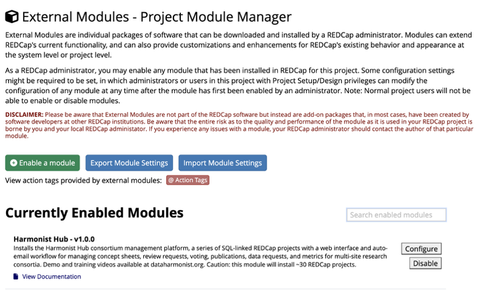
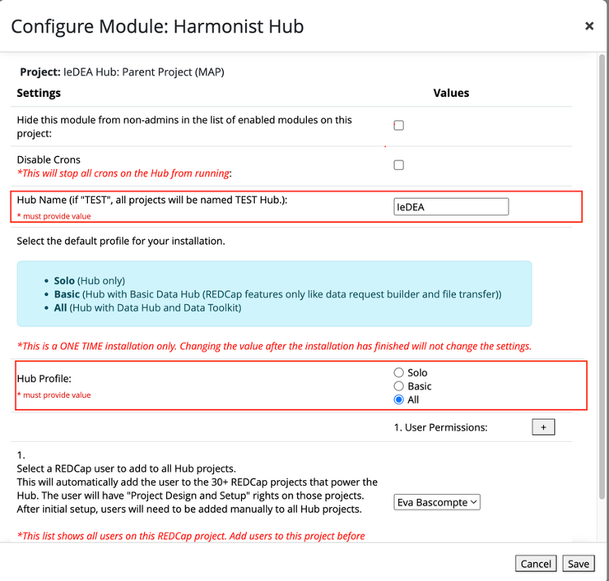
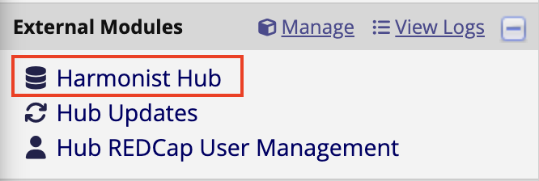
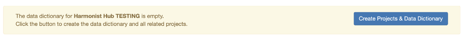

# IeDEA-Harmonist Technical Installation

<h2>1. Harmonist Hub Configuration</h2>

After an admin has activated the Harmonist Hub External Module in a project, we need to add some data on the configuration page.

In the configuration window enter the mandatory fields.

1. Hub Name: The name the hub and projects will have. This will be the main name added to all projects. It is recommended to not add a very long name.  
2. Hub Profile: This field is mandatory but any value works.

Another interesting field is *User Permissions.* This field allows the admin to add a user (previously added to the current project) to be part of the installation. This means that, as soon as the install starts this user will also be added to the 30+ REDCap projects that power the Hub.

<h2>1. First Time Install</h2>

If this is the first time activating the module, after configuring it, you need to install all the projects that will make the module work.

1. On the External Modules section click on the new link that will appear. The First time you see the link, it will be under Harmonist Hub, that will change later to your Hub’s name.

   

2. A message will display prompting the user to click the button to create and install the necessary projects to use the external module.

3. Click and install the projects and you are ready to start adding data to them.  
4. It is recommended to start with the “Settings” project.

<h2>3. Data Hub</h2>

If the project also has a Data Hub, please contact a Harmonist Hub administrator as there are extra steps that need to be taken care of for the tool to work.
